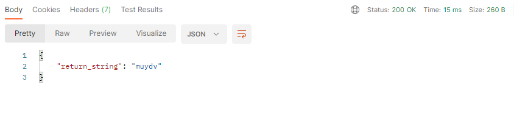

# <strong> Lyft Apprenticeship (2022) </strong>

## Hello and Welcome

This is my submission for Software Engineering Apprenticeship (2022) at Lyft.

This application is my attempt to submit a small code sample that satisfies the following criteria:

- Accept a POST request to the route “/test”, which accepts one argument “string_to_cut”.

- Return a JSON object with the key “return_string” and a string containing every third letter from the original string.

(e.g.) If you POST {"string_to_cut": "iamyourlyftdriver"}, it will return: {"return_string": "muydv"}.

## My Result:

 

# Installs and Packages

    1: express

    2: dotenv

<strong>Thank you<strong>
